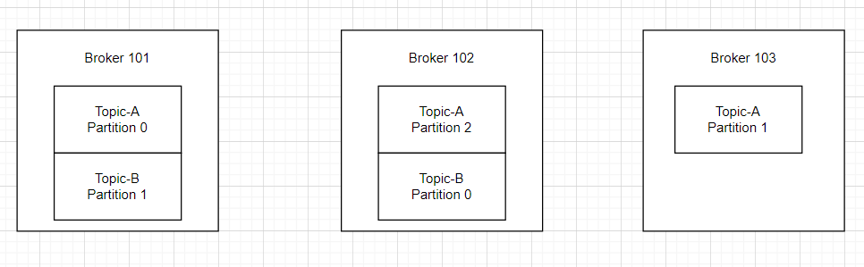
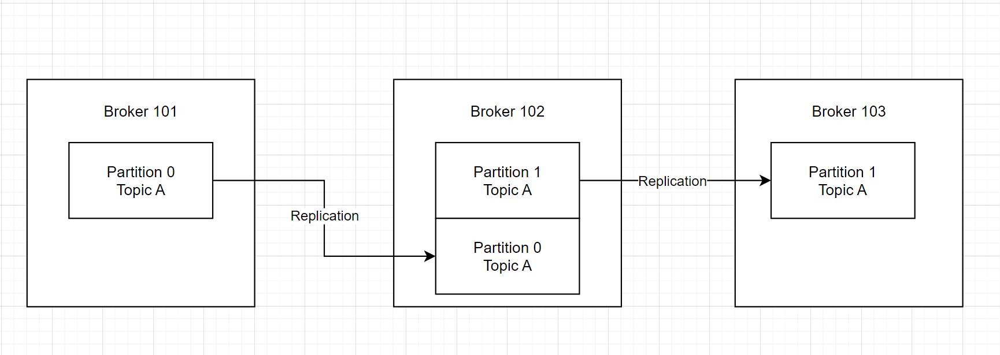

# Kafka concept

## Key capabilities

Kafka combines three key capabilities so you can implement your use cases for event streaming end-to-end with a single battle-tested solution:

1. To **publish (write)** and **subscribe to (read)** streams of events, including continuous import/export of your data from other systems.
2. To **store streams of events durably and reliably** for as long as you want.
3. To process **streams of events** as they occur or retrospectively.

## Kafka Component

1. **Event**: (record or message).
2. **Topic**:
    - A particular stream of data, **identified by its name**.
    - Cannot query data in topics.
    - You can have as many topic as you want.
3. **Partition**:
    - Topic is spread over a number of "buckets" located on different Kafka brokers.
    - Messages within each partition are ordered.
    - Each message within a partition gets an incremental id, caled **offset**.
    - Topics are **immutable**.
    - You can have as many partitions per topic as you want.
4. **Broker**:
    - A Kafka cluster is composed of multiple brokers (server).
    - Each broker is identified with its ID (integer).
    - Each broker contains certain topic partitions.
    - After connection to any broker (called a bootstrap broker), you will be connected to the entire cluster (Kafka clients have smart mechanics for that).
5. **Producer**: publish event to Kafka.
6. **Consumer**: subcribe event.

### **Important Note**

- Once the data is written to a partion, **it cannot be changed (immutability)**.
- Data is kept only for limited time (default is one week - configurable).
- Offset only have meaning for a specific partition.

## Brokers and Topics

Example: Topic A haves 3 partitions and Topic B haves 2 partitions.

## Kafka Broker Discovery

- Every Kafka broker is also called a "boostrap server".
- That means that **you only need to connect to one broker**, and the Kafka clients will know how to be connected to the entire cluster (smart clients).
- Each broker knows about all brokers, topics and partitions (metadata).

## Topic replication factor

- Topics should have a replication factor > 1 (usually between 2 and 3).
- This way if a broker is down, another broker canserve the data.

Example: When Broker 102 is down, we have broker 101 and 103 still up and they can still serve the data.

## Concept of Leader for a Partition

- At any time only **ONE** broker can be leader for a given partition.
- Producers can only send data to the broker that is **LEADER** of a partition. The other brokers will replicate the data. Therefore, each partion has one leader and multiple ISR (in-sync replica).

**Note**: Producers/Consumers only write/read data into/from **leader**. But since Kafka 2.4, it possible to configure consumers to read from closest replica.

## Producer Acknowledgements (acks)

- Producer can choose to receive acknowledgment of data writes:
  - **acks=0**: Producer won't wait for acknowledgment (possible data loss).
  - **acks=1**: Producer will wait for leader acknowledgment (limited data loss).
  - **acks=all**: Producer will wait leader + replicas acknowledgment (no data loss).

## Kafka Topic Durability

- As a result, for a replication factor of N, you can permanently lose up to N-1 brokers and still recover your data.
