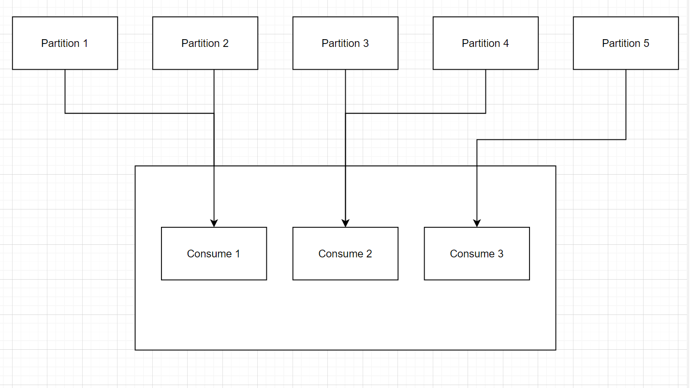

# Consumer Groups

- All the consumers in an application read data as a consumer groups
- Each consumer within a group reads from exclusive partitions
- In Kafka it is acceptable to have multiple consumer groups on the same topic
- In a consumer group, only **one consumer** is going to be assigned to **one partitions**
- Note: Amount of consumers in group should be equal or fewer than amount of partitions, if it is greater, consumer will stand by.

### Consumer offsets

- Kafka stores the offsets at whch a consumer group has been reading
- The offsets commited are in **Kafka Topic** named **__consumer_offsets**
- When a consumer in a group has processed data received from kafka, it should be **preiodically** committing the offsets (the Kafka broker will write to **__consumer_offsets**, not the group itself)
- There are 3 delivery semantics if you choose to commit manually
    - At least once (usually preferred):
        - Offsets are committed after he message is processed
        - If the processing goes wrong, the message will be read again
        - This can result in duplicate processing of messges. Make sure your processing is idempotent
    - At most once:
        - Offsets are commted as soon as messge are received
        - If the processing gores wrong, some messages will be lost (threy won't be read again)
    - Exactly once:
        - For Kafka => Kafka workflows: use the Transactional API (easy with Kafka Stream API)
        - For Kafka => External System workflows: use an idempotent consumer