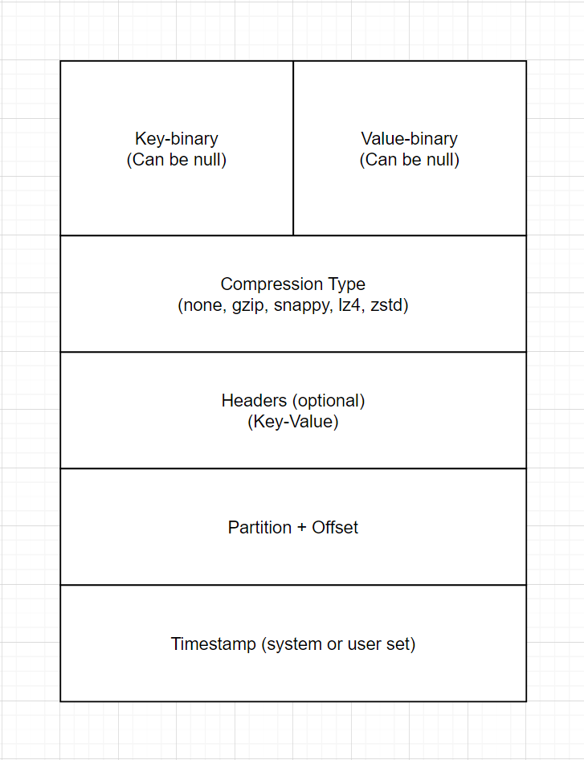

# Producers

- Producers write data to topics (which are made of partitions).
- Producers know to which partition to write to (and which Kafka broker has it).
- In case of Kafka broker failures, Producers will automatically recover.

### Message


### Keys

- Producer can choose o send a **key** with the message (string, number, binary, etc,...)
- Key is created by producer.
- If **key = null**, data is send round robin (partition 0 -> partition 1 -> partition 3 -> ...)
- If **key != null**, then all messages for that key will always go to the same partition (hashing)
- A key are typically send if you need message ordering for a specific field (ex: truck_id)

#### Key hashing

- A Kafka partitioner is a code logic that takes a record and determines to which partition to send it into.
- **Key Hashing** is the process of determining the mapping of a key to a partition.
- In the default Kafka partitioner, the keys are hashed using the **murmur2 algorithm**, with the formula below for the curious:

```targetPartition = Math.abs(Utils.murmur2(keyBytes)) % (numPartitions - 1)```

### Serializer

- Kafka only accepts bytes as an input from producers and send bytes out as an output to consumers
- Message serialization means transforming objects / data into bytes.
- They are used on the key and the value.
- Common Serializer:
  - String (incl. JSON).
  - Int, Float.
  - Avro.
  - Protobuf.
